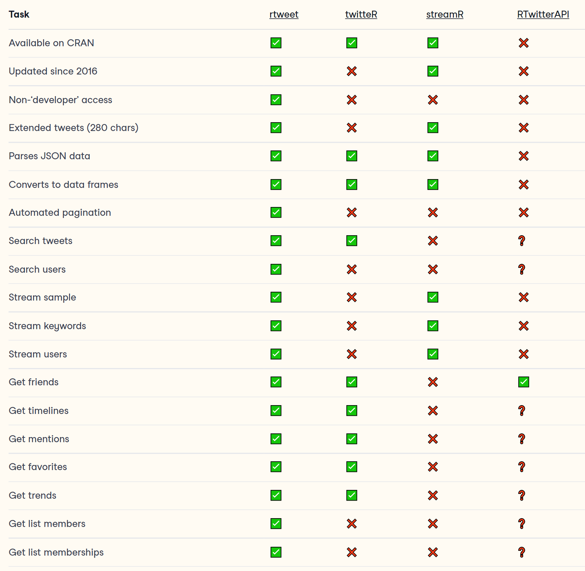
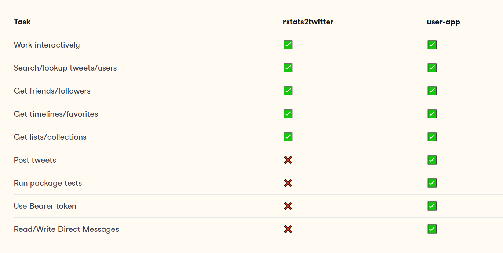
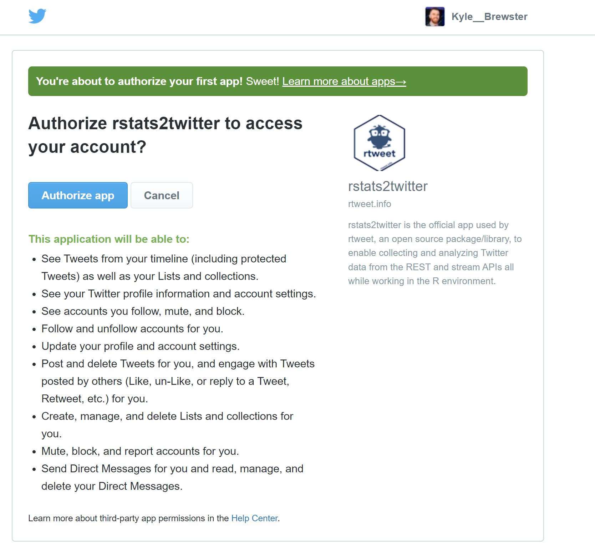
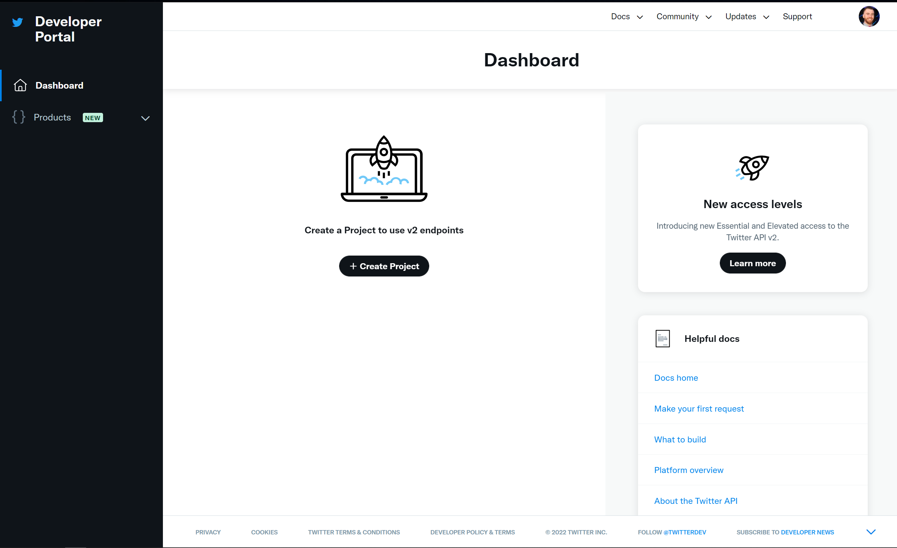
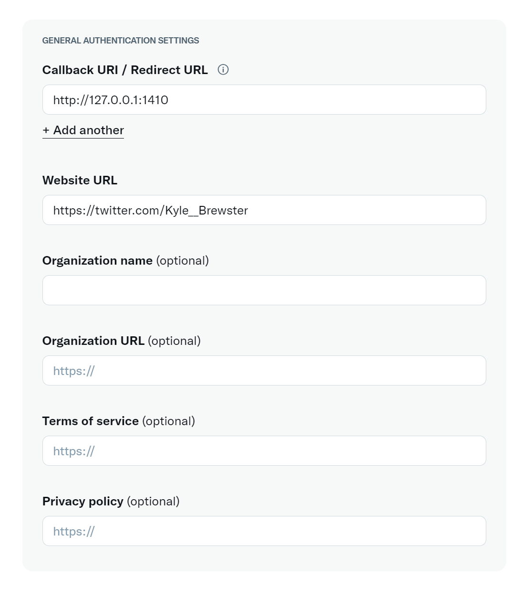

```{r include=FALSE}
library(xaringan)
```

```{r setup, include=FALSE}
knitr::opts_chunk$set(echo = TRUE)
```

# Introduction

Presentation and code composed in

```{r echo=FALSE}
R.version$version.string
```


Packages used in addition to base `R`:

-   `rtweet`: Core package
-   `pacman`: Package manager to install/load libraries
-   `httpuv`: Web-scraping capabilities (just needs to be installed)

---

# Resources

.pull-left[
**Package Documentation**

- [R OpenSci](https://docs.ropensci.org/rtweet/index.html)
- [CRAN](https://cran.r-project.org/web/packages/rtweet/rtweet.pdf)
- [RDocumentation](https://www.rdocumentation.org/packages/rtweet/versions/0.7.0)
- [Github](https://github.com/ropensci/rtweet) 

**Usage Tutorials**

- [Slides by Author of
    `rtweet`](https://mkearney.github.io/nicar_tworkshop/#1)
- [Searching Twitter with
    rtweet](https://www.infoworld.com/article/3515712/how-to-search-twitter-with-rtweet-and-r.html)

**Twitter**

- [Developer Platform API Reference
    Index](https://developer.twitter.com/en/docs/api-reference-index)
- [Guides & Reference for Developer
    Platform](https://developer.twitter.com/en/docs)]
    
.pull-right[
**Vignettes**

- Intro to rtweet
   - `vignette("rtweet")`
- Access tokens and authentication
   - `vignette("auth", package = "rtweet")`
- Live streaming tweets
   - `vignette("stream", package = "rtweet")`
- Troubleshooting common problems
   - `vignette("FAQ", package = "rtweet")`]
   
> <b><i>Be sure to check which version of documention being used</b></i>

---
# Basic Arguments
`q`  
-   Character string used to define search parameters
-   Can use `" "` to enclose string
-   Also recognizes boolean `AND` and `OR` operators; Search
    exact phrases with double-quotes
-   *Ex:*
    -   `q = "data science"` tweets containing both "data" and
        "science" in any order
    -   `q = "data OR science"` tweets containing "data" or
        "science"
    -   `q = ' "data science" '` tweets containing the exact
        phrase "data science"  
        
`n`
-   Number of tweets to return
-   Low values suggested for sandbox development)
-   Defaults at `n = 100` for `search_tweets()`
---
`type`  
-   Type of tweets to include (defaults to `"recent"`)
-   Can also include `"mixed"` or `"popular"`

`include_rts`  
-   Takes `TRUE`/`FALSE` value (defaults to `T`)  

`geo_code`  
-   Define geographical area for searches
-   Template following `=` sign is "*latitude, longitude,
    radius*"
-   *Ex:*
    -   `geocode = "44.043905,-123.07494,0.5mi"` would be an
        approximation for the Twittersphere of the University of
        Oregon campus
        
`max_id`
-   Returns results with ID less than (or equal to) specified
    value
-   *i.e.* Additional layer of filtering results by time
---
`parse`  
-   Logical indicator to determine whether to return parsed
    data.frame
-   Setting `parse = TRUE` saves time/effort of manually
    navigating return lists
-   Setting `parse = FALSE` ensures the maximum amount of
    possible information is returned
    
`token`  
-   Set equal to `NULL` by default
-   Allows specification of user app; often stored as
    environmental variable
-   See `?tokens` and `vignettes("auth","rtweet")` for more

`retryonratelimit`  
-   Takes `TRUE`/`FALSE` value
-   Automatically pauses search when results reach cap for time
    interval and resumes search at interval refresh
    
`verbose`  
-   Takes `TRUE`/`FALSE` value (defaults to `T`)
-   Defines if to include output processing/retrieval messages
    (i.e. estimations for time between searches)
---
# Other Useful Arguments
`timeout`
- Value in seconds to define when to stop searching

`lang`/`langs()`
- Argument to define language parameters
   - `lang = en` for English
- Also can used to call database of languages from the Library of Congress

`lookup_coords()`
- Gets latitude/longitude coordinates for a specified location
- Able to be used as an independent function

`next_cursor`
- Goes to next pages of results/items when manually selecting next would otherwise be required
    
`media`
- Specify file path for media to be included in tweets, posts, and etc.
---

# What is `rtweet`?

A technical definition:

> "An implementation of calls designed to collect and organize
> Twitter data *via Twitter's REST and stream Application Program
> Interfaces (API)"*

-   Recall that **APIs** are sets of protocols that govern
    interactions between sites and users
-   Web browsers *render content* while APIs *manage & organize
    data*

Simply put,

> `rtweet` allows use to retrieve real-time information from all
> publicly available data in the Twitterverse and provides
> options for interacting with Twitter via an authorized account

---
# A Quick Lesson in Twitter

Defining and redefining some words according to the [Twitter
Glossary of
Terms](https://help.twitter.com/en/resources/glossary)

-   **Twitterverse**: the collective reference to all things
    relating to Twitter
-   **Retweet**:
    -   *(n.)* A non-original tweet that was shared on your
        timeline;
    -   *(v.)* Sharing another account's Tweet to followers; a
        *tweet* is the post itself or the act of posting
-   **Likes**: previously referred to as *favorites*, changed as
    of 2015; terms are synonymous
-   **Hashtag**: text following a `#` symbol; denotes keywords,
    topics, and/or trends associated
-   **Timeline**: a real-time stream of Tweets; your home
    timeline displays all tweets those you follow
-   **Trend**: a topic/hashtag algorithmically determined by
    Twitter to be "popular" at the moment
-   **Friends**: Accounts/users that a specific user follows

---

# Why use `rtweet`?

Contains [greater
functionality](https://www.rdocumentation.org/packages/rtweet/versions/0.7.0)
compared to other R packages for accessing and interacting with
Twitter's APIs

Other similar packages include:

-   [`twitteR`](https://cran.r-project.org/web/packages/twitteR/twitteR.pdf)
-   [`streamR`](https://cran.r-project.org/web/packages/streamR/streamR.pdf)
-   [`RTwitterAPI`](https://github.com/joyofdata/RTwitterAPI/)

Much of the functionality of alternative packages are outdated, so plan to use `rtweet` whenever interacting with Twitter through `R`

---
# `rtweet` vs other Packages

<div style="width:525px">

</div>

---
# Terms of Use

Use in accordance with Twitter's [developer terms and
    conditions of
    use](https://developer.twitter.com/en/developer-terms/more-on-restricted-use-cases)  

Likely won't matter in the classroom, but would be important
   to consider if working with or sharing large amounts of data,
    using in a professional environment, using as a developer, or
    planning to program automation  
    
Examples of term violations include:

 -   Use, storage, and/or sharing of sensitive information
 -   Certain unauthorized redistribution of content
 -   Creating spam or certain automated interactions with Twitter
 -   Surveillance or other forms of privacy invasion
---

# User Authentication

In order to interact with Twitter APIs via `rtweet`, you need
to first become an authenticated user. **You will need to
have a Twitter account**. If you do not have an account, you
can sign up for one [here](https://twitter.com/i/flow/signup)

There are two methods to become an authorized user
 1.   Authentication through package-app called `rstats2twitter`
 2.   Creating your own application (done via the Twitter Developer Portal)

> Authentication must happen prior to being able to run any
> package commands

---
# Functionality of Authentication Methods Compared



Read more about *current* Twitter API interaction limitations and access levels [here](https://developer.twitter.com/en/docs/twitter-api/getting-started/about-twitter-api#v2-access-level)

---
# The Setup

First, **Install packages**

```{r echo=TRUE, eval=FALSE}
pacman::p_load(rtweet) # Install and load rtweet
```

If you try to run package functions prior to receiving
authentication

```{r initial_err, echo=TRUE, eval=FALSE}
search_tweets("#rstats", n = 10, include_rts = FALSE)
```

Your `R` session will paused after running the initial command
with the following message:

```{r echo=TRUE}
# Requesting token on behalf of user...
# Waiting for authentication in browser...
# Press Esc/Ctrl + C to abort
```

---
You should be automatically redirected to Twitter with a request
to authorize the `rstats2twitter` app

<div style="width:450px">

</div>


Congratulations! You are now set up to use `rtweet`
---
# Creating a User App

Creating a user-app to authenticate as a user requires a few
additional setup steps, but provides better functionality and
less oversight as a script

The ***Twitter Developer Portal*** is where you can configure
apps for interacting with Twitter's APIs

-   <https://developer.twitter.com/apps>
-   *Note:* Can only create three (3) user applications per
    24-hour period per account
---
Once verified and fully logged in, you should arrive at the
dashboard


---

.pull-left[
Click on <`Create Project`> and fill the required text-fields
- Assign a name, describe intent for use, provide project description

You will be automatically taken to a section to create an application under your new project
- Could also open existing project from Twitter Developer  Dashboard home

Select <`Add App`> from desired project
- Give your app a unique name
   - *Suggested:* `{{initials}}_twitter_app`
   - Keep note of the keys
            ]
.pull-right[

]  

> This will be the last time you are able to see *all* of this information (unless you regenerate new keys or create a new app)

---
.pull-left[
After creating the app, open the app settings and select <`Set up`> under ***'User authentication settings'***

- Will be given option to select `OAuth 1.0a` and `OAuth 2.0`
- Select `Read and write and Direct message` to enable full package functionality
- For now we only care about two fields

   - `Website URL`
      - https://twitter.com/{{your_screen_name}}
   - `Callback URL`
      - http://127.0.0.1:1410
            ]
.pull-right[

]

> The callback URL **_MUST BE EXACT_** for your user-app to work

---
## Back to the Console
Store the name of app as `app_name` in `R` script
```{r eval=FALSE}
# Assigning app name to variable
app_name = "kb_rtweet_demo"
```
Assign API Key and Key Secret
```{r eval=FALSE}
# Assigning keys to variables 
consumer_key = "your-key-here"
consumer_secret = "your-key-here"
```
Then pass the variables to `create_token()` to create your own
token

```{r eval=FALSE}
# Creating token
token = create_token(app_name, consumer_key, consumer_secret)
```
---
You can save yourself some future effort by storing your token as
an environmental variable

Otherwise will need to be manually specified for each function if
intended to authenticate via user-app since `token = NULL` by default

```{r saving_paths, eval=FALSE}
# Save token to home directory
path_to_token <- file.path(path.expand("~"), ".twitter_token.rds")
saveRDS(token, path_to_token)
# Create env variable TWITTER_PAT (with path to saved token)
env_var <- paste0("TWITTER_PAT=", path_to_token)
# save as .Renviron file (or append if the file already exists)
cat(env_var, file = file.path(path.expand("~"), ".Renviron"), 
  fill = TRUE, append = TRUE)
```

Since the `.Renviron` is typically processed at session start up,
refresh again
```{r refreshing Renviron, eval=FALSE}
# Refresh .Renviron variables
readRenviron("~/.Renviron")
```

Congratulations (again)! You are now ready to use `rtweet` with a
user-app

See [R Workshop
Presentation](https://mkearney.github.io/nicar_tworkshop/#11)
from package creator for more details
---
# Basic Arguments
`q`  
-   Character string used to define search parameters
-   Can use `" "` to enclose string
-   Also recognizes boolean `AND` and `OR` operators; Search
    exact phrases with double-quotes
-   *Ex:*
    -   `q = "data science"` tweets containing both "data" and
        "science" in any order
    -   `q = "data OR science"` tweets containing "data" or
        "science"
    -   `q = ' "data science" '` tweets containing the exact
        phrase "data science"  
        
`n`
-   Number of tweets to return
-   Low values suggested for sandbox development)
-   Defaults at `n = 100` for `search_tweets()`
---
`type`  
-   Type of tweets to include (defaults to `"recent"`)
-   Can also include `"mixed"` or `"popular"`

`include_rts`  
-   Takes `TRUE`/`FALSE` value (defaults to `T`)  

`geo_code`  
-   Define geographical area for searches
-   Template following `=` sign is "*latitude, longitude,
    radius*"
-   *Ex:*
    -   `geocode = "44.043905,-123.07494,0.5mi"` would be an
        approximation for the Twittersphere of the University of
        Oregon campus
        
`max_id`
-   Returns results with ID less than (or equal to) specified
    value
-   *i.e.* Additional layer of filtering results by time
---
`parse`  
-   Logical indicator to determine whether to return parsed
    data.frame
-   Setting `parse = TRUE` saves time/effort of manually
    navigating return lists
-   Setting `parse = FALSE` ensures the maximum amount of
    possible information is returned
    
`token`  
-   Set equal to `NULL` by default
-   Allows specification of user app; often stored as
    environmental variable
-   See `?tokens` and `vignettes("auth","rtweet")` for more

`retryonratelimit`  
-   Takes `TRUE`/`FALSE` value
-   Automatically pauses search when results reach cap for time
    interval and resumes search at interval refresh
    
`verbose`  
-   Takes `TRUE`/`FALSE` value (defaults to `T`)
-   Defines if to include output processing/retrieval messages
    (i.e. estimations for time between searches)
---
# Other Useful Arguments
`timeout`
- Value in seconds to define when to stop searching

`lang`/`langs()`
- Argument to define language parameters
   - `lang = en` for English
- Also can used to call database of languages from the Library of Congress

`lookup_coords()`
- Gets latitude/longitude coordinates for a specified location
- Able to be used as an independent function

`next_cursor`
- Goes to next pages of results/items when manually selecting next would otherwise be required
    
`media`
- Specify file path for media to be included in tweets, posts, and etc.
---
# Functions & Functionality

`search_tweets()`
-   Search for tweets containing a specific hashtag up to a
    defined value
```{r search_tweets, eval=FALSE}
# Searches for up to 40 tweets (excluding retweets) with
# the hashtag 'rstats'
search_tweets("#rstats", n = 40, include_rts = FALSE)
```
`search_users()`
-   Basic search for users given specified criteria
-   Results limited to 1,000 by Twitter API
```{r search_users, eval=FALSE}
# Searches up to 20 users with the hashtag 'rstats' in their bio
search_users("#rstats", n = 20)
```
---
`stream_tweets()`
- Streams public statues to a file
- Will occupy `R` session until specified time has elapsed
    - Streaming itself takes little memory if running in a
        second `R` session, but the parsing may result in
        computational strain
    - *Solution:* Set `parse = FALSE` to deal with later in
        workflow
- `timeout = 30` by default, to stream indefinitely set to
    `timeout = Inf`
- Set `append = TRUE` to attach stream to end `file_name`
    - Setting to `FALSE` will overwrite `file_name`
    ```{r stream_tweets, eval=FALSE}
    # Sample randomly from all tweets, set to be parsed later
    stream_tweets("",
                  file_name = "all_tweets_stream.json",
                  parse = FALSE)

    # Stream tweets in the US mentioning 'election' for 5 minutes,
    # and attach results to the end of an existing file
    stream_tweets("election",
                  timeout = 300,
                  location = lookup_coords("usa"),
                  file_name = "usa.json",
                  append = TRUE)
    ```
---
`get_friends()` and `get_followers()`
-   Generate list of friends/followers for a specified account
```{r get_friends/followers, eval=FALSE}
# Looking at who RStudio follows
get_friends("@rstudio")

# and 100 users who follow RStudio
get_followers("@rstudio", n=100)
```
`get_favorites()`
-   Obtain lists of likes (a.k.a. favorites) for an account
```{r get_favorites, eval=FALSE}
# Gets 10 most recently liked tweets by RStudio
get_favorites("rstudio", n = 10)
```
`get_timeline()`
-   Returns timeline of a user (i.e. what they have tweeted)
```{r get_timelines, eval=FALSE}
# Get 100 most recent tweets from RStudio
get_timeline("@rstudio", n = 100)
```
---
# Account Actions via the `R` Console

Updates have allowed `rstats2twitter` authenticated users to
utilize additional functionality with the need to create a
user-app with a Twitter Developer account

- Some online documentation may be incorrect/outdated


`post_tweet()`
- Posts status update to user's Twitter account
```{r eval=FALSE}
# Posting tweet to account
post_tweet(status = "Messing around in R #rtweet #rstudio")
```
---
`direct_messages()`
- View message inbox up to a specified number of messages
- Can also use `direct_messages_sent` and `direct_messages_received` for filtering messages
```{r eval=FALSE}
# Obtain last 50 messages for account
direct_messages(n=50)

# Messages recived since the posting of a specific tweet
direct_messages_received(
   n=50,
   max_id = last_status_id) ## include actual tweet ID number
```

`post_message()`
-   Send a direct message (DM) to a specified recipient
```{r eval=FALSE}
# Setting path for media attachment
tmp = "./images/msg_img.gif"

post_message(text  = "Here's a gif to brighten your day -past Kyle",
             user  = "Kyle__Brewster",
             media = tmp)
```
---
# Significane for Economics?

On [average](https://www.omnicoreagency.com/twitter-statistics/#:~:text=Daily%20Tweet%20statistics,200%20billion%20tweets%20every%20year.):

- 200 billion tweets shared in a year 
   - 500 million tweets every day
      - 350,000 tweets per minute
         - 6,000 tweets per second
- Well over 1 million tweets have been posted since beginning this presentation

...That's a lot of data!

---
# Final Thoughts

-   Remember you must have an internet connection
    -   Getting *all* followers for a popular account could take several days
-   `rtweet` allows use to derive interesting analysis from the
    Twitterverse
    -   Helpful in understanding public opinion
    -   Tracking specific trends/hashtags
    -   Script over swiping gives us more options and and
        improved *scalability*
-   Any API data usage restrictions are likely set by Twitter,
    don't blame `R`
    -   Keep usage in in mind if encountering issues
-   Keep an eye out for platform changes and package updates (or
    new packages)
-   Some existing guides and resources contain inaccurate
    information since
    -   Broken hyperlinks
    -   Updates to `R`, the Twitter APIs, and/or the Twitter
        platform will inevitably change functionality over time
-   Use ethically - ***"With great powers, comes great
    responsibility"***


